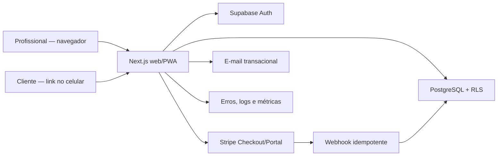

# AcompanhAí — plano completo de produto e implementação

> Versão: 1.0 — 12 de agosto de 2026  
> Objetivo: servir como especificação inicial para criar e desenvolver o repositório no Codex.  
> Estado: plano recomendado, ainda dependente de validação comercial, decisões do responsável pelo produto e criação de contas externas.

## 1. Resumo executivo

O AcompanhAí será um SaaS em português para profissionais brasileiros que prestam serviços recorrentes no Japão. O foco inicial são personal trainers que precisam acompanhar clientes entre sessões sem depender de planilhas, mensagens dispersas e cobranças manuais de resposta.

No MVP, o profissional cria o cliente, monta um plano simples de atividades, envia um convite por link e acompanha as respostas em um painel. O cliente não precisa instalar aplicativo nem criar senha: abre um link seguro, recebe uma sessão no dispositivo e registra conclusão, dificuldade e observações. O AcompanhAí cobra a assinatura do profissional em ienes; não processa os pagamentos entre profissional e cliente no MVP.

A hipótese central não é “monetização garantida”, e sim: profissionais pagarão por uma ferramenta se ela reduzir o tempo gasto cobrando respostas e aumentar a visibilidade sobre quem precisa de atenção. Essa hipótese deve ser testada com clientes reais antes de ampliar o produto.

## 2. Decisões de produto assumidas

Estas decisões tornam o plano executável. Devem ser confirmadas pelo responsável antes da primeira cobrança real.

| Tema                 | Decisão inicial                                                          | Motivo                                                          |
| -------------------- | ------------------------------------------------------------------------ | --------------------------------------------------------------- |
| Mercado              | Brasileiros no Japão                                                     | Idioma, contexto cultural e cobrança em JPY bem definidos       |
| Nicho inicial        | Personal trainers independentes                                          | Rotina recorrente e necessidade clara de acompanhamento         |
| Plataforma           | Aplicação web responsiva/PWA, sem app nativo                             | Menor custo e acesso imediato por link                          |
| Usuário pagante      | Profissional                                                             | Modelo simples de SaaS B2B pequeno                              |
| Usuário acompanhado  | Cliente do profissional, sem conta no MVP                                | Reduz atrito de adesão                                          |
| Cobrança             | Assinatura mensal do profissional em JPY                                 | Previsibilidade operacional; valor final ainda será validado    |
| Uso do link          | Convite de uso único que vira sessão segura no navegador                 | Evita um link permanente com acesso irrestrito                  |
| Comunicação          | Compartilhamento manual via WhatsApp/LINE/e-mail                         | Evita integrações e custos antes da validação                   |
| Dados de saúde       | Não coletar diagnóstico, lesão, medicação, fotos corporais ou prontuário | Reduz risco e mantém o escopo no acompanhamento operacional     |
| IA                   | Sem conteúdo gerado automaticamente no MVP                               | Primeiro validar o fluxo central e criar controles de segurança |
| Localização de dados | Banco e funções em Tóquio quando disponível                              | Menor latência e melhor alinhamento com o público inicial       |

## 3. Visão do produto

### Visão

Ser a forma mais simples para um profissional brasileiro no Japão acompanhar a execução do serviço fora do encontro presencial, mantendo cada cliente, plano e resposta em um único lugar.

### Resultado desejado para o profissional

- Saber em menos de dois minutos quem está em dia, atrasado ou sem responder.
- Criar e reutilizar planos sem reconstruir tudo em mensagens.
- Enviar um acesso que o cliente consegue usar no celular sem instalar nada.
- Manter um histórico mínimo e pesquisável de acompanhamento.

### Resultado desejado para o cliente

- Entender claramente o que precisa fazer hoje.
- Responder em poucos toques.
- Pedir ajuda sem procurar mensagens antigas.
- Usar a ferramenta em português e com horários do Japão.

### Princípios

1. **Celular primeiro:** o fluxo do cliente deve funcionar bem em telas pequenas e redes móveis.
2. **Português claro:** evitar jargão técnico, médico ou jurídico na interface.
3. **Ação antes de relatório:** a tela inicial prioriza clientes que precisam de atenção.
4. **Privacidade por padrão:** coletar apenas o necessário e limitar acesso por organização.
5. **Intervenção humana:** a ferramenta organiza e sugere; o profissional decide.

## 4. Público, problema e proposta de valor

### Persona primária: personal trainer brasileiro no Japão

- Trabalha sozinho ou em equipe pequena.
- Atende em academia, estúdio, parque ou on-line.
- Usa WhatsApp/LINE, notas e planilhas para acompanhar alunos.
- Cobra em ienes e quer uma ferramenta em português.
- Tem pouco tempo para configurar software e não quer treinar seus clientes no uso.

### Persona secundária: cliente acompanhado

- Usa principalmente o celular.
- Pode não ter familiaridade com sistemas de treino.
- Quer instruções objetivas, privacidade e pouco atrito.
- Não deve ser obrigado a criar senha no primeiro contato.

### Problemas a validar

1. O profissional perde tempo perguntando individualmente se o cliente cumpriu o combinado.
2. O histórico fica fragmentado entre mensagens, arquivos e memória.
3. O cliente não sabe qual é a versão atual do plano.
4. O profissional percebe tarde demais quem abandonou a rotina.
5. Soluções existentes podem ser complexas, em outro idioma ou desalinhadas à rotina local.

### Proposta de valor

“Crie o acompanhamento, envie um link e veja quem precisa de atenção — em português, no celular e com a sua rotina no Japão.”

### Hipóteses falsificáveis

| Hipótese                  | Sinal mínimo em piloto                                                   | Se falhar                                        |
| ------------------------- | ------------------------------------------------------------------------ | ------------------------------------------------ |
| O problema é frequente    | 8 de 12 entrevistados relatam acompanhamento manual semanal              | Rever nicho ou problema principal                |
| O link reduz atrito       | 70% dos clientes convidados registram a primeira resposta em 48 h        | Simplificar convite e primeira tela              |
| O painel economiza tempo  | 60% dos profissionais relatam economia de pelo menos 30 min/semana       | Automatizar priorização ou abandonar a proposta  |
| Existe disposição a pagar | 3 de 5 pilotos aceitam iniciar cobrança em uma faixa testada             | Rever preço, valor ou segmento                   |
| Há uso recorrente         | 50% dos profissionais ativos usam o painel em 3 semanas distintas no mês | Melhorar hábito, lembretes ou adequação do fluxo |

## 5. Escopo do MVP

### Incluído

#### Conta e organização do profissional

- Cadastro com nome, e-mail, senha e confirmação de e-mail.
- Recuperação de senha.
- Uma organização por profissional no MVP, preparada no banco para múltiplos membros.
- Configurações: nome comercial, fuso `Asia/Tokyo`, idioma `pt-BR` e status da assinatura.
- Onboarding curto com criação do primeiro cliente e primeiro plano.

#### Gestão de clientes

- Criar, editar, arquivar e pesquisar clientes.
- Campos mínimos: nome preferido, canal de contato, identificador de contato opcional, observação interna curta e status.
- Não exigir e-mail ou telefone do cliente; o profissional pode compartilhar o link no canal que já utiliza.
- Indicadores: sem plano, aguardando convite, em dia, atenção e inativo.

#### Modelos e planos

- Criar modelos reutilizáveis.
- Criar um plano para um cliente a partir de um modelo ou do zero.
- Itens com título, instrução curta, dias da semana, ordem e estado ativo.
- Publicar uma versão do plano; mudanças futuras não alteram respostas históricas.
- Pausar e encerrar plano.

#### Acesso do cliente por link

- Gerar convite aleatório de uso único, com validade padrão de sete dias.
- O link é trocado por cookie de sessão `HttpOnly`, `Secure`, `SameSite=Lax`, válido por 30 dias.
- Depois da troca, redirecionar para URL sem token; o token é armazenado apenas como hash e marcado como usado.
- Permitir revogar todas as sessões do cliente e emitir novo convite.
- Exibir plano atual e check-ins do próprio cliente, nunca dados de outros clientes.

#### Check-in

- Cliente marca item como `feito`, `parcial` ou `não feito` para a data local do Japão.
- Pode informar dificuldade de 1 a 5 e observação de até 500 caracteres.
- Pode editar a resposta até 24 horas depois; depois disso, apenas o profissional pode corrigir, deixando trilha de auditoria.
- Profissional vê o resumo por cliente e o detalhe cronológico.
- Regra inicial de “atenção”: dois dias planejados consecutivos sem resposta ou dificuldade 4/5.

#### Painel do profissional

- Lista priorizada: atenção, sem resposta, em dia, sem plano.
- Resumo dos últimos sete dias: itens previstos, respondidos e concluídos.
- Filtros por status e busca por nome.
- Ação rápida para abrir cliente, copiar convite e revisar respostas.

#### Cobrança do SaaS

- Stripe Checkout hospedado para assinatura mensal em JPY.
- Stripe Customer Portal para atualizar forma de pagamento e cancelar.
- Webhooks assinados como fonte de verdade do acesso pago.
- Modo de teste obrigatório até aprovação explícita do responsável pelo produto.
- Período de teste, preço e impostos são configuração comercial, não constantes no código.

#### Operação e suporte

- Página de privacidade, termos, contato e aviso comercial aplicável no Japão.
- Canal de solicitação de acesso, correção e exclusão de dados.
- Exportação CSV simples de clientes e check-ins pelo profissional.
- Logs de auditoria para ações sensíveis.
- Monitoramento de erros e rotina de backup/restauração testada.

### Fora do MVP

- Aplicativos nativos iOS/Android.
- Pagamento do serviço do personal trainer pelo cliente, repasse, comissão ou Stripe Connect.
- Agenda, reserva de horário e videoconferência.
- Integração automática com WhatsApp, LINE, SMS ou wearables.
- Fotos de progresso, medidas corporais, dieta, diagnóstico, lesão ou prontuário.
- Chat em tempo real.
- IA gerando treino, dieta, avaliação clínica ou decisão automática.
- Equipes com convites e permissões avançadas.
- Personalização por salão, estética ou professores.
- Marketplace de profissionais.

## 6. Funcionalidades pós-MVP, condicionadas a evidência

| Prioridade | Funcionalidade                        | Condição para entrar                                                      |
| ---------- | ------------------------------------- | ------------------------------------------------------------------------- |
| P1         | Lembretes por e-mail/LINE             | Falta de resposta for o principal motivo de abandono                      |
| P1         | Equipe e perfis `manager`/`coach`     | Pelo menos 3 clientes pagantes solicitarem equipe                         |
| P1         | PWA instalável e notificações         | Uso recorrente no navegador estiver comprovado                            |
| P2         | Agenda e recorrência de sessões       | Entrevistas mostrarem que substitui uma ferramenta paga atual             |
| P2         | White-label leve                      | Profissionais associarem marca própria à retenção                         |
| P2         | Pagamentos do cliente ao profissional | Validação jurídica, fiscal e de marketplace concluída                     |
| P2         | Fotos e medidas                       | DPIA/avaliação de impacto, consentimento e controles reforçados aprovados |
| P3         | Verticais de salão, estética e aulas  | Fluxo do personal trainer atingir retenção satisfatória                   |
| P3         | IA para resumir respostas             | Base de dados, consentimento, avaliação e revisão humana implementados    |
| P3         | Aplicativo nativo                     | Métricas mostrarem limitação real da web/PWA                              |

## 7. Fluxos principais

### 7.1 Fluxo do profissional

1. Acessa a landing page e cria conta.
2. Confirma e-mail e informa nome comercial.
3. Vê o onboarding: “cadastre um cliente”, “crie um plano”, “envie o convite”.
4. Cadastra cliente com dados mínimos.
5. Escolhe modelo ou cria plano com itens e dias.
6. Revisa e publica a versão do plano.
7. Gera convite e copia a mensagem pronta para WhatsApp/LINE.
8. O cliente usa o convite e responde.
9. O painel sobe clientes que precisam de atenção.
10. O profissional abre o histórico, entra em contato fora do sistema e ajusta o plano se necessário.
11. Quando o acesso gratuito terminar, o profissional escolhe o plano e conclui Stripe Checkout.

### 7.2 Fluxo do cliente por link

1. Recebe uma mensagem do profissional com explicação e link.
2. Abre o link; a aplicação valida validade, uso e revogação.
3. O token é trocado por sessão segura e removido da URL.
4. Vê o nome do profissional, aviso de privacidade curto e botão “Continuar”.
5. Confirma ciência do tratamento de dados necessário ao acompanhamento.
6. Vê apenas as atividades previstas para hoje e a opção de consultar a semana.
7. Marca o estado, dificuldade e comentário opcional.
8. Recebe confirmação imediata e pode editar por 24 horas.
9. Em novo dispositivo ou após expiração, solicita novo link ao profissional.

### 7.3 Estados excepcionais

- Convite expirado/usado/revogado: mostrar mensagem neutra e orientação para pedir novo link, sem revelar se o cliente existe.
- Sem plano publicado: mostrar “Seu profissional ainda está preparando o acompanhamento”.
- Assinatura do profissional inadimplente: manter leitura e exportação por 14 dias, bloquear novas publicações; não apagar dados automaticamente.
- Erro ao responder: preservar o texto no navegador e permitir tentar de novo.
- Cliente arquivado: revogar sessões e bloquear novas respostas; manter histórico conforme política de retenção.

## 8. Papéis e permissões

### Papéis do sistema

- `platform_admin`: operação interna; acesso excepcional, auditado e não usado no dia a dia.
- `owner`: proprietário da organização, clientes, planos, cobrança, exportação e exclusão.
- `member`: reservado no banco para pós-MVP; só entra na interface após regras de equipe.
- `client_session`: sessão limitada a um único cliente, sem conta Supabase.
- `service_role`: processos internos específicos, nunca enviado ao navegador.

### Matriz de acesso do MVP

| Recurso             |             Platform admin |       Owner da organização | Outro owner |                       Sessão do cliente |
| ------------------- | -------------------------: | -------------------------: | ----------: | --------------------------------------: |
| Organização         |           suporte auditado |                 ler/editar |      nenhum |                    nome público somente |
| Cliente             |           suporte auditado |                       CRUD |      nenhum |             ler o próprio perfil mínimo |
| Plano e itens       |           suporte auditado |                       CRUD |      nenhum |            ler versão publicada própria |
| Check-ins           |           suporte auditado | ler/corrigir com auditoria |      nenhum |     criar/ler próprios; editar até 24 h |
| Convites/sessões    |       revogar em incidente |              criar/revogar |      nenhum | trocar convite; encerrar própria sessão |
| Assinatura          |        suporte de cobrança |    ler/gerenciar no portal |      nenhum |                                  nenhum |
| Exportação/exclusão | executar processo auditado |         solicitar/executar |      nenhum |      solicitar ao controlador informado |

Todas as tabelas públicas devem ter RLS habilitada. Políticas exigem associação do usuário à `organization_id`; o caminho do cliente usa funções server-side específicas e sessão opaca, sem acesso direto do navegador ao banco.

## 9. Arquitetura recomendada

### Visão lógica



### Decisões arquiteturais

- **Monólito modular:** uma aplicação Next.js concentra UI, rotas e serviços. Microserviços não se justificam no MVP.
- **Server-first:** leitura e mutações sensíveis acontecem no servidor. JavaScript no cliente é usado apenas onde melhora interação.
- **PostgreSQL multi-tenant:** todas as entidades de negócio carregam `organization_id`; RLS é a barreira principal contra vazamento entre profissionais.
- **Região:** Supabase em `ap-northeast-1` (Tóquio) e funções Vercel em `hnd1`, sujeitos à disponibilidade/plano na criação das contas.
- **Sem arquivos privados no MVP:** reduz superfície de risco. Se avatars entrarem, usar bucket separado e políticas RLS.
- **Eventos externos idempotentes:** armazenar `stripe_event_id` único antes de aplicar alteração.
- **Datas:** persistir instantes em UTC (`timestamptz`) e a data operacional do check-in como `date` calculada em `Asia/Tokyo`.
- **Soft delete seletivo:** clientes e planos usam `archived_at`; solicitações de exclusão usam processo separado e auditável.

### Stack sugerida

| Camada          | Escolha                                                   | Regra de uso                                                    |
| --------------- | --------------------------------------------------------- | --------------------------------------------------------------- |
| Runtime         | Node.js LTS vigente, versão fixada no repositório         | Atualizar deliberadamente, nunca flutuar em produção            |
| Web             | Next.js estável, App Router, React e TypeScript `strict`  | Fixar versões e lockfile no primeiro commit                     |
| UI              | Tailwind CSS + shadcn/ui                                  | Componentes acessíveis e tokens próprios, sem tema excessivo    |
| Formulários     | React Hook Form + Zod                                     | Mesmo schema de validação no cliente e servidor                 |
| Banco/Auth      | Supabase PostgreSQL + Auth                                | Migrações SQL versionadas; RLS em toda tabela exposta           |
| Acesso a dados  | `@supabase/ssr` e funções SQL explícitas                  | Sem ORM no MVP; tipos gerados do schema                         |
| Pagamentos      | Stripe Checkout, Billing e Customer Portal                | JPY, webhooks verificados, sem dados de cartão no app           |
| E-mail          | Resend ou Postmark                                        | Escolher um após verificar entrega no Japão e domínio           |
| Testes          | Vitest, Testing Library, Playwright, pgTAP/Supabase local | Cobrir domínio, RLS, fluxos críticos e webhooks                 |
| Qualidade       | ESLint, Prettier, `tsc --noEmit`                          | Obrigatórios na integração contínua                             |
| Observabilidade | Sentry + logs estruturados da hospedagem                  | Não registrar token, comentário do cliente ou PII desnecessária |
| Hospedagem      | Vercel                                                    | Preview por pull request; produção protegida                    |
| CI              | GitHub Actions                                            | lint, tipos, testes, build e testes de migração                 |

Não adotar uma dependência apenas porque aparece nesta lista: conferir versão estável, licença, custo e compatibilidade no dia da criação do repositório.

## 10. Estrutura inicial do repositório

```text
acompanhai/
├─ .github/
│  ├─ workflows/ci.yml
│  └─ pull_request_template.md
├─ docs/
│  ├─ architecture/adr/
│  ├─ product/
│  ├─ privacy/
│  └─ runbooks/
├─ public/
├─ src/
│  ├─ app/
│  │  ├─ (marketing)/
│  │  ├─ (auth)/
│  │  ├─ (dashboard)/dashboard/
│  │  ├─ c/                    # experiência do cliente sem token na URL
│  │  ├─ convite/[token]/      # troca de convite por sessão
│  │  └─ api/
│  │     ├─ stripe/checkout/
│  │     ├─ stripe/portal/
│  │     ├─ stripe/webhook/
│  │     └─ health/
│  ├─ components/
│  │  ├─ ui/
│  │  └─ features/
│  ├─ features/
│  │  ├─ auth/
│  │  ├─ organizations/
│  │  ├─ clients/
│  │  ├─ plans/
│  │  ├─ checkins/
│  │  ├─ client-access/
│  │  └─ billing/
│  ├─ lib/
│  │  ├─ env.ts
│  │  ├─ supabase/
│  │  ├─ stripe/
│  │  ├─ observability/
│  │  └─ security/
│  ├─ server/
│  │  ├─ actions/
│  │  ├─ repositories/
│  │  └─ services/
│  └─ types/
├─ supabase/
│  ├─ migrations/
│  ├─ seed.sql
│  └─ tests/
├─ tests/
│  ├─ unit/
│  ├─ integration/
│  └─ e2e/
├─ .env.example
├─ package.json
├─ pnpm-lock.yaml
├─ README.md
└─ SECURITY.md
```

### Regras de organização

- Cada `feature` contém schema, serviço, consultas e testes do domínio.
- Componentes em `components/ui` não conhecem banco nem regras de negócio.
- Nenhuma chave secreta é importada por módulo marcado para o cliente.
- Migrações são imutáveis depois de aplicadas; correções entram em nova migração.
- Decisões relevantes são registradas em ADR curto: contexto, decisão e consequências.

## 11. Modelo de dados inicial

Convenções: UUID como chave primária, `created_at`/`updated_at` em `timestamptz`, `organization_id` obrigatório nas entidades multi-tenant, enums via `check constraint` ou tipos PostgreSQL versionados.

### Tabelas

#### `profiles`

- `id uuid PK` → `auth.users.id`
- `display_name text not null`
- `locale text not null default 'pt-BR'`
- `timezone text not null default 'Asia/Tokyo'`
- `created_at`, `updated_at`

#### `organizations`

- `id uuid PK`
- `name text not null`
- `slug text unique not null`
- `timezone text not null default 'Asia/Tokyo'`
- `status text` (`trial`, `active`, `past_due`, `read_only`, `closed`)
- `created_at`, `updated_at`

#### `organization_members`

- `organization_id uuid FK`
- `user_id uuid FK`
- `role text` (`owner`, `member`)
- `created_at`
- PK composta (`organization_id`, `user_id`)
- Regra MVP: exatamente um `owner`; convite de `member` desabilitado na UI.

#### `clients`

- `id uuid PK`, `organization_id uuid FK`
- `display_name text not null` (1–100)
- `contact_channel text` (`whatsapp`, `line`, `email`, `other`, `none`)
- `contact_value text null` (normalizado quando aplicável)
- `internal_note text null` (máx. 1000; aviso para não inserir dados médicos)
- `status text` (`active`, `paused`, `archived`)
- `archived_at timestamptz null`
- `created_at`, `updated_at`
- Índice: (`organization_id`, `status`, `display_name`).

#### `plan_templates`

- `id uuid PK`, `organization_id uuid FK`
- `name text not null`, `description text null`
- `archived_at timestamptz null`
- `created_at`, `updated_at`

#### `plan_template_items`

- `id uuid PK`, `organization_id uuid FK`, `template_id uuid FK`
- `title text not null` (1–120)
- `instructions text null` (máx. 1000)
- `weekdays smallint[] not null` (ISO 1–7)
- `position integer not null`
- Restrição única (`template_id`, `position`).

#### `plans`

- `id uuid PK`, `organization_id uuid FK`, `client_id uuid FK`
- `name text not null`
- `status text` (`draft`, `published`, `paused`, `ended`)
- `current_version integer not null default 1`
- `starts_on date not null`, `ends_on date null`
- `published_at`, `ended_at`, `created_at`, `updated_at`
- Regra: apenas um plano publicado/pausado por cliente no MVP.

#### `plan_versions`

- `id uuid PK`, `organization_id uuid FK`, `plan_id uuid FK`
- `version integer not null`
- `snapshot jsonb not null` com itens validados no momento da publicação
- `published_by uuid FK profiles`
- `created_at`
- Restrição única (`plan_id`, `version`).

O snapshot preserva o contexto de respostas antigas. Os dados editáveis continuam normalizados nas tabelas de itens.

#### `plan_items`

- `id uuid PK`, `organization_id uuid FK`, `plan_id uuid FK`
- `title text not null`, `instructions text null`
- `weekdays smallint[] not null`
- `position integer not null`, `active boolean not null default true`
- `created_at`, `updated_at`

#### `checkins`

- `id uuid PK`, `organization_id uuid FK`, `client_id uuid FK`
- `plan_id uuid FK`, `plan_version integer not null`, `plan_item_id uuid FK`
- `scheduled_on date not null`
- `status text` (`done`, `partial`, `not_done`)
- `difficulty smallint null` com restrição 1–5
- `comment text null` com máximo de 500 caracteres
- `submitted_at timestamptz`, `updated_at timestamptz`
- `corrected_by uuid null`, `correction_reason text null`
- Restrição única (`client_id`, `plan_item_id`, `scheduled_on`).
- Índices: (`organization_id`, `scheduled_on`) e (`client_id`, `scheduled_on desc`).

#### `client_invites`

- `id uuid PK`, `organization_id uuid FK`, `client_id uuid FK`
- `token_hash text unique not null` (SHA-256/HMAC; nunca token puro)
- `expires_at`, `used_at`, `revoked_at`, `created_at`
- `created_by uuid FK`
- Índice parcial para convites ainda válidos.

#### `client_sessions`

- `id uuid PK`, `organization_id uuid FK`, `client_id uuid FK`
- `session_hash text unique not null`
- `expires_at`, `last_seen_at`, `revoked_at`, `created_at`
- Armazenar somente hash; cookie contém valor aleatório com pelo menos 256 bits.

#### `subscriptions`

- `organization_id uuid PK/FK`
- `provider text default 'stripe'`
- `stripe_customer_id text unique`
- `stripe_subscription_id text unique null`
- `stripe_price_id text null`
- `status text` espelhando estados relevantes da Stripe
- `current_period_end timestamptz null`, `cancel_at_period_end boolean`
- `created_at`, `updated_at`

#### `webhook_events`

- `provider text`, `event_id text`, `event_type text`
- `received_at`, `processed_at`, `failed_at`, `attempts integer`
- `payload_redacted jsonb null`, `error_code text null`
- PK composta (`provider`, `event_id`) garante idempotência.

#### `privacy_consents`

- `id uuid PK`, `organization_id uuid FK`, `client_id uuid FK`
- `document_type text`, `document_version text`
- `accepted_at timestamptz`, `evidence jsonb` sem IP completo quando não necessário
- Índice (`client_id`, `document_type`, `accepted_at desc`).

#### `privacy_requests`

- `id uuid PK`, `organization_id uuid null`, `requester_type`, `request_type`
- `status`, `received_at`, `due_at`, `resolved_at`
- `resolution_note text`; detalhes sensíveis ficam em sistema operacional restrito.

#### `audit_events`

- `id bigint identity PK`, `organization_id uuid null`
- `actor_type`, `actor_id text null`, `action`, `entity_type`, `entity_id`
- `metadata jsonb` com lista permitida de campos
- `created_at`; append-only, sem comentários ou tokens.

### Integridade e retenção

- FKs devem impedir entidade de uma organização apontar para outra; usar chaves compostas onde necessário.
- Normalizar nomes apenas para busca; preservar a grafia original.
- Check-ins ficam disponíveis enquanto houver relação contratual e pelo período definido na política de retenção. Definir prazo final com assessoria jurídica antes do lançamento.
- Logs técnicos: 30 dias como ponto de partida; auditoria: 12 meses como hipótese operacional; revisar necessidade e custo.
- Exclusão: revogar sessões imediatamente, exportar se solicitado, anonimizar ou excluir conforme obrigação aplicável e registrar conclusão sem conservar o conteúdo removido.

## 12. Contratos de aplicação e eventos

### Operações internas principais

- `createClient(input)` → valida limite do plano, cria cliente e audita.
- `createPlan(clientId, input)` → cria rascunho pertencente à mesma organização.
- `publishPlan(planId)` → valida ao menos um item, cria snapshot e incrementa versão.
- `issueClientInvite(clientId)` → revoga convites anteriores ainda ativos, retorna token uma única vez.
- `exchangeInvite(token)` → compara hash em tempo constante, marca uso e cria sessão.
- `submitCheckin(session, input)` → deriva `client_id` da sessão, nunca do corpo da requisição.
- `createCheckoutSession(organizationId)` → deriva organização da sessão autenticada e usa `price_id` do servidor.
- `processStripeWebhook(event)` → verifica assinatura, persiste ID, processa idempotentemente.

### Eventos Stripe mínimos

- `checkout.session.completed`: associar customer/subscription à organização.
- `customer.subscription.created|updated|deleted`: atualizar estado local.
- `invoice.paid`: renovar acesso.
- `invoice.payment_failed`: marcar `past_due` e iniciar comunicação.

Nunca liberar acesso apenas porque o navegador retornou à `success_url`. A confirmação vem do webhook verificado.

### Estados de assinatura e acesso

| Estado local | Comportamento                                              |
| ------------ | ---------------------------------------------------------- |
| `trial`      | Uso conforme período configurado                           |
| `active`     | Acesso completo                                            |
| `past_due`   | Acesso completo por até 7 dias, com aviso                  |
| `read_only`  | Leitura/exportação por mais 7 dias; sem novo cliente/plano |
| `closed`     | Login para exportar/solicitar exclusão; sem operação       |

Os prazos são proposta de produto e precisam de aprovação antes de produção.

## 13. Pagamentos em ienes

### Escopo financeiro do MVP

O AcompanhAí cobra apenas a assinatura do profissional. Não recebe dinheiro em nome do personal trainer, não divide pagamento e não mantém saldo. Isso evita assumir operação de marketplace antes de validação jurídica e comercial.

### Implementação

- Moeda Stripe: `jpy`.
- JPY é moeda sem casas decimais na API: ¥1.980 é enviado como `1980`, nunca `198000`.
- Criar produtos/preços no Stripe e referenciar `STRIPE_PRICE_ID_MONTHLY`; não codificar preço em componentes.
- Checkout em modo `subscription` e Customer Portal hospedado.
- Salvar apenas IDs e estado; nenhum dado de cartão no AcompanhAí.
- Verificar assinatura do webhook com corpo bruto e secret específico por ambiente.
- Responder `2xx` rapidamente e processar com idempotência/retry.
- Testar: pagamento aprovado, 3DS, falha, repetição de webhook, cancelamento imediato/no fim do período e troca de cartão.

### Faixas para validação, não promessa de preço

- Trial gratuito de 14 ou 30 dias para testar com clientes reais.
- Hipótese inicial do plano Inicial: ¥980/mês.
- Hipótese inicial do plano Profissional: ¥1.980/mês.
- Qualquer plano acima de ¥1.980/mês fica para uma fase pós-MVP, após validação.

Esses valores e o trial são hipóteses de validação, não preços, condições ou promessas definitivas. Nada entra em produção sem aprovação explícita do responsável, revisão de custos e taxas, impostos, termos e condições comerciais; as tarifas da Stripe devem ser conferidas na conta japonesa antes do lançamento.

### Dependências externas

- Conta Stripe habilitada no país e entidade escolhidos.
- Verificação de identidade/empresa, conta bancária e aprovação da Stripe.
- Decisão sobre pessoa física/empresa, tratamento fiscal e imposto sobre consumo no Japão.
- Página acessível com preço, cobrança, cancelamento, operador, endereço e contato, conforme revisão da legislação japonesa aplicável a vendas on-line.
- Termos de uso e política de reembolso/cancelamento revisados por profissional qualificado.

## 14. Segurança, LGPD, APPI e privacidade

Este plano é técnico e não substitui orientação jurídica no Brasil ou no Japão. Como o serviço atende pessoas no Japão, pode haver obrigações pela APPI japonesa; como envolve brasileiros, operação e comunicação em português, a aplicabilidade da LGPD deve ser analisada. Tratar a conformidade com ambas como requisito de lançamento, não como selo automático.

### Papéis a confirmar juridicamente

- Para dados da conta e cobrança, a empresa AcompanhAí tende a atuar como controladora.
- Para dados dos clientes inseridos pelo profissional, o profissional pode ser controlador e o AcompanhAí operador; isso depende do contrato e das finalidades reais.
- Supabase, Vercel, Stripe, e-mail e monitoramento serão operadores/suboperadores conforme seus contratos.
- Registrar países/regiões de hospedagem e transferências internacionais; obter DPA quando aplicável.

### Privacy by design

- Inventário de dados com finalidade, base legal, origem, destinatário e retenção.
- Coleta mínima: nome preferido, canal opcional, plano e resposta; nenhum dado médico no MVP.
- Aviso curto no primeiro acesso do cliente e política completa acessível.
- Versão dos termos/avisos registrada no aceite.
- Canal para confirmação, acesso, correção, portabilidade quando aplicável, oposição e exclusão.
- Sem analytics publicitário ou cookies não essenciais no MVP.
- Exportação e exclusão testadas antes da produção.
- Revisão de transferências para qualquer provedor fora do Japão.

### Controles técnicos mínimos

- TLS em trânsito; criptografia gerenciada em repouso.
- RLS e testes negativos entre duas organizações em todas as entidades.
- `service_role` apenas no servidor e em poucos módulos; rotação em incidente.
- Segredos separados para desenvolvimento, preview e produção; `.env` fora do Git.
- Proteção CSRF/origin em mutações; cookies `HttpOnly`, `Secure` e `SameSite`.
- Convites/sessões aleatórios, com hash, expiração, rotação e revogação.
- Rate limit por IP anonimizado + chave de recurso para login, convite e check-in.
- Headers: CSP, HSTS, `X-Content-Type-Options`, `Referrer-Policy: no-referrer`, `X-Robots-Tag: noindex` no cliente.
- Validação Zod no servidor, escaping por padrão e texto simples nos comentários.
- Logs estruturados com IDs técnicos; remover token, e-mail, contato e comentário.
- Dependências verificadas e atualizadas em lotes testados.
- Backup e exercício de restauração antes do piloto pago.

### Resposta a incidentes

1. Conter: revogar chaves/sessões, desabilitar rota ou integração afetada.
2. Preservar evidência mínima e montar linha do tempo.
3. Avaliar categorias, pessoas, países e risco.
4. Acionar responsável jurídico para determinar notificações à ANPD, PPC e titulares nos prazos aplicáveis.
5. Corrigir, testar, comunicar com transparência e registrar prevenção.

Criar `docs/runbooks/security-incident.md` com contatos reais antes da produção. A PPC informa obrigações específicas de comunicação para incidentes que possam prejudicar direitos; a ANPD também mantém orientações e checklists para agentes de pequeno porte.

## 15. Uso responsável de IA

### MVP

- Não enviar respostas de clientes a modelos de IA.
- Não gerar treino, dieta, diagnóstico, recomendação clínica ou alerta de risco.
- O status “atenção” usa regra determinística, explicável e visível ao profissional.

### Possível fase futura: resumo assistido

Só iniciar após validação do produto e análise de impacto. Requisitos:

- Opt-in do profissional e informação clara ao cliente.
- Provedor e região aprovados; contrato que impeça treinamento com dados do produto quando disponível.
- Minimização/pseudonimização antes do envio.
- Saída rotulada como sugestão, nunca como fato ou orientação médica.
- Revisão obrigatória pelo profissional antes de qualquer ação.
- Botão de feedback e registro de modelo, versão, prompt e resultado sem reter conteúdo além do necessário.
- Conjunto de testes em português brasileiro para omissão, alucinação, tom, viés e instruções perigosas.
- Kill switch e fallback sem IA.
- Proibição de decisão automatizada de cancelar, suspender ou classificar saúde do cliente.

## 16. Requisitos não funcionais

| Área            | Critério para MVP                                                                                    |
| --------------- | ---------------------------------------------------------------------------------------------------- |
| Desempenho      | P75 da tela de check-in interativa em até 2,5 s em rede móvel de teste no Japão                      |
| Resposta        | Mutação de check-in confirma em até 2 s no P95, fora de indisponibilidade externa                    |
| Disponibilidade | Meta operacional de 99,5% mensal, sem compromisso contratual inicial                                 |
| Acessibilidade  | Fluxos críticos por teclado, foco visível, labels, contraste e WCAG 2.2 AA como referência           |
| Compatibilidade | Duas versões mais recentes de Safari iOS, Chrome Android e navegadores desktop principais            |
| Localização     | Interface pt-BR; datas em `dd/MM/yyyy`; horário `Asia/Tokyo`; dinheiro `ja-JP`/JPY conforme contexto |
| Segurança       | Zero falha crítica/alta conhecida; testes RLS e sessão passando                                      |
| Recuperação     | Backup diário conforme plano do provedor; restauração testada com evidência                          |
| Observabilidade | Erro com correlation ID; alerta para webhooks falhos e taxa de erro anormal                          |

As metas devem ser medidas com tráfego e aparelhos reais; testes locais não bastam.

## 17. Backlog inicial priorizado

Escala Fibonacci; nenhuma história excede 8 pontos. Estimativas servem para planejamento inicial e devem ser refeitas pela equipe.

| ID    | História resumida                                   | Prioridade | Pontos | Dependência          |
| ----- | --------------------------------------------------- | ---------: | -----: | -------------------- |
| EN-01 | Fundação do repositório, CI e ambientes             |    Crítica |      5 | contas GitHub/Vercel |
| EN-02 | Schema multi-tenant, migrações e RLS                |    Crítica |      8 | Supabase             |
| US-01 | Cadastro, confirmação e recuperação do profissional |       Alta |      5 | EN-01/02, e-mail     |
| US-02 | Onboarding e organização inicial                    |       Alta |      3 | US-01                |
| US-03 | Criar/editar/arquivar cliente                       |       Alta |      5 | EN-02                |
| US-04 | Criar modelo e plano em rascunho                    |       Alta |      5 | US-03                |
| US-05 | Publicar plano versionado                           |       Alta |      5 | US-04                |
| US-06 | Gerar e trocar convite por sessão                   |    Crítica |      8 | US-03, EN-02         |
| US-07 | Cliente consulta atividades                         |       Alta |      3 | US-05/06             |
| US-08 | Cliente envia/edita check-in                        |    Crítica |      5 | US-07                |
| US-09 | Painel prioriza clientes                            |       Alta |      5 | US-08                |
| US-10 | Detalhe e histórico do cliente                      |       Alta |      3 | US-08                |
| US-11 | Assinatura Stripe em JPY                            |       Alta |      8 | conta Stripe         |
| US-12 | Portal, inadimplência e modo leitura                |       Alta |      5 | US-11                |
| US-13 | Exportação e solicitação de privacidade             |       Alta |      5 | US-03/08             |
| EN-03 | Auditoria, rate limit e headers                     |    Crítica |      5 | EN-01/02             |
| EN-04 | Observabilidade, backup e runbooks                  |       Alta |      5 | contas externas      |
| EN-05 | Testes E2E e piloto controlado                      |    Crítica |      8 | fluxos concluídos    |

### Critérios de aceitação críticos

#### US-03 — Gerir cliente

Como profissional, quero cadastrar e organizar clientes para centralizar meus acompanhamentos.

- Dado um owner autenticado, quando cadastra nome válido, então o cliente aparece apenas na sua organização.
- Dado nome vazio ou acima do limite, quando envia, então vê erro em português e nada é persistido.
- Dado owner de outra organização, quando tenta acessar o ID, então recebe resposta neutra e nenhum dado.
- Dado cliente arquivado, quando o owner confirma, então sessões são revogadas e o histórico é preservado.
- Fluxo principal funciona por teclado e em viewport móvel.

#### US-05 — Publicar plano

Como profissional, quero publicar uma versão do plano para que meu cliente veja instruções consistentes.

- Dado rascunho com item e dia válidos, quando publica, então uma versão imutável é criada.
- Dado plano vazio, quando publica, então a ação é bloqueada com orientação.
- Dada edição posterior, quando consulta check-in antigo, então aparece a versão vigente na data.
- Dado segundo plano ativo para o mesmo cliente, quando publica, então o sistema exige pausar/encerrar o anterior.
- A publicação gera evento de auditoria sem conteúdo sensível.

#### US-06 — Acesso por convite

Como cliente, quero abrir um convite sem criar senha para acessar meu acompanhamento com pouco atrito.

- Dado convite válido, quando abre, então recebe sessão segura e é redirecionado para URL sem token.
- Dado convite usado, expirado ou revogado, quando abre, então não recebe sessão nem informação sobre o cadastro.
- Dada sessão de um cliente, quando tenta ID de outro, então nenhum dado é retornado.
- Dado novo convite emitido, quando configurado para revogar anteriores, então links pendentes deixam de funcionar.
- Tokens não aparecem em logs, analytics, referer ou banco em texto puro.
- Teste de 100 mil tokens aleatórios não encontra acesso válido e aciona rate limit.

#### US-08 — Registrar check-in

Como cliente, quero responder rapidamente para que meu profissional acompanhe minha execução.

- Dada atividade prevista hoje, quando envia estado válido, então uma resposta única é registrada na data de Tóquio.
- Dada repetição da requisição, quando ocorre retry, então não cria resposta duplicada.
- Dado comentário acima de 500 caracteres, quando envia, então mostra erro sem perder o texto digitado.
- Dada resposta com menos de 24 h, quando edita, então a alteração é salva; após 24 h, a edição é bloqueada.
- Dada indisponibilidade, quando falha, então a interface preserva os dados e permite tentar novamente.

#### US-09 — Painel priorizado

Como profissional, quero ver quem precisa de atenção para agir sem revisar cliente por cliente.

- Dado dificuldade 4/5, quando o painel carrega, então o cliente aparece em “atenção”.
- Dados dois dias planejados consecutivos sem resposta, então o cliente aparece em “atenção” com motivo.
- Dado cliente sem pendência, então aparece em “em dia”.
- O owner vê somente agregados da sua organização.
- Lista com até 100 clientes carrega dentro da meta de desempenho definida.

#### US-11 — Assinatura em JPY

Como profissional, quero assinar em ienes para usar o serviço com preço local claro.

- Dado plano selecionado, quando inicia checkout, então a sessão Stripe usa `jpy` e o `price_id` aprovado no servidor.
- Dado retorno de sucesso sem webhook, então o acesso não é liberado indevidamente.
- Dado webhook válido repetido, então o evento é processado uma vez.
- Dada assinatura cancelada no fim do período, então acesso permanece até a data confirmada pela Stripe.
- Dado webhook com assinatura inválida, então recebe rejeição, alerta e nenhum estado muda.
- O app nunca recebe nem registra dados completos de cartão.

#### US-13 — Direitos de dados

Como titular ou controlador, quero solicitar acesso ou exclusão para exercer direitos de privacidade.

- Dado owner autenticado, quando exporta, então recebe CSV apenas da própria organização.
- Dada solicitação, quando registrada, então recebe protocolo e prazo interno.
- Antes de excluir, identidade e escopo são verificados por processo documentado.
- Concluída a exclusão, sessões são revogadas e conteúdo removido/anonimizado conforme política.
- A auditoria comprova a execução sem reter o conteúdo excluído.

### Definition of Ready

- História tem persona, benefício, critérios testáveis e no máximo 8 pontos.
- Design/fluxo móvel está claro.
- Dependências externas e dados tratados estão identificados.
- Estados de erro, segurança, acessibilidade e métricas foram considerados.
- Não há decisão jurídica/comercial em aberto que mude substancialmente a implementação.

## 18. Plano de execução em 8 semanas

Referência: uma pessoa de produto/engenharia em dedicação integral, sprints de duas semanas, velocidade inicial hipotética de 20 pontos. Compromisso máximo: 16–17 pontos (80–85%); o restante fica para bugs e descobertas. Se a disponibilidade for 50%, reduzir escopo, não comprimir o calendário. A velocidade real substitui a hipótese após o primeiro sprint.

### Sprint 1 — Semanas 1–2: fundação e prova do risco central

**Objetivo:** profissional autentica, cria cliente e o isolamento multi-tenant está comprovado.

- Semana 1: confirmar decisões, criar repositório, ambientes, CI, design tokens, Supabase local/remoto, schema inicial.
- Semana 2: auth, organização, CRUD de cliente, RLS e testes negativos entre tenants.
- Comprometido sugerido: EN-01 (5), parte fechada de EN-02 (8), US-02 (3) = 16 pontos.
- Trabalho paralelo não pontuado pelo time técnico: 8–12 entrevistas e protótipo navegável.
- Saída: preview utilizável, migration do zero passando e pelo menos dois testes de isolamento por tabela criada.
- Gate: se o problema não aparecer em pelo menos 8/12 entrevistas, pausar construção de plano/check-in e revisar posicionamento.

### Sprint 2 — Semanas 3–4: plano e experiência do cliente

**Objetivo:** ciclo completo “criar plano → enviar convite → cliente responder” funciona em celular.

- Semana 3: modelos, plano, itens, publicação versionada.
- Semana 4: convite de uso único, sessão do cliente, tela semanal e primeiro check-in.
- Comprometido sugerido: US-04 (5), US-05 (5), US-07 (3) = 13; fatiar US-06 em segurança/base (5) e acabamento no sprint seguinte.
- Teste moderado com 3 profissionais e 6–10 clientes em dados fictícios/consentidos.
- Saída: fluxo E2E no preview e teste de segurança do token.
- Gate: ao menos 70% dos convidados de teste concluem um check-in sem ajuda síncrona; caso contrário, corrigir UX antes do painel.

### Sprint 3 — Semanas 5–6: operação, painel e cobrança em teste

**Objetivo:** profissional consegue operar a rotina e testar assinatura sem dinheiro real.

- Semana 5: completar sessão/check-in, painel priorizado, histórico e estados excepcionais.
- Semana 6: Stripe em test mode, portal, webhooks idempotentes, limites de plano e modo leitura.
- Comprometido sugerido após refinamento: US-08 (5), US-09 (5), US-10 (3), fatia de US-11 (3) = 16.
- Saída: cinco cenários Stripe automatizados e painel observado em uso por pilotos.
- Gate: não ativar live mode sem entidade/conta bancária, preço, impostos, termos e política de cancelamento aprovados.

### Sprint 4 — Semanas 7–8: privacidade, qualidade e piloto

**Objetivo:** lançar piloto controlado com segurança, suporte e métricas.

- Semana 7: exportação, solicitações de privacidade, auditoria, rate limits, headers, acessibilidade e observabilidade.
- Semana 8: E2E, restauração de backup, teste em aparelhos reais, correções, runbooks e onboarding dos pilotos.
- Comprometido sugerido: US-13 (5), EN-03 (5), fatia de EN-04 (3), fatia de EN-05 (3) = 16.
- Saída: 5 profissionais no piloto, checklist de release assinado e plano de suporte.
- Gate: produção paga só com zero vulnerabilidade crítica/alta conhecida, restauração testada, webhook confiável, documentos legais publicados e responsável de incidente definido.

### Se houver apenas 6 semanas

Entregar até o fim do Sprint 3 e manter cobrança apenas em modo teste. Adiar modelos reutilizáveis, exportação self-service, Sentry e piloto pago. Não cortar RLS, sessão segura, privacidade mínima, testes de webhook ou restauração.

### Cerimônias leves

- Planejamento quinzenal de 60–90 min.
- Check-in diário assíncrono: concluído, próximo, bloqueio.
- Refinamento semanal de 45 min.
- Demo e retrospectiva no fim do sprint.
- Acompanhar: pontos concluídos, compromisso cumprido, escopo alterado, bugs escapados e lead time.

## 19. Validação comercial

### Fase 1 — Descoberta, semanas 1–2

- Recrutar 12–15 personal trainers brasileiros em regiões distintas do Japão.
- Não apresentar a solução nos primeiros 15 minutos; mapear processo atual, frequência, custo de tempo e tentativas anteriores.
- Pedir exemplos recentes, não opiniões genéricas.
- Registrar: número de clientes ativos, canais usados, minutos/semana, falhas mais caras e ferramentas pagas.
- Critério: problema recorrente e urgente em pelo menos dois terços das entrevistas.

### Fase 2 — Concierge, semanas 3–4

- Selecionar 5 design partners.
- Simular o painel/protocolo manualmente com protótipo e links de teste.
- Observar o cliente usando sem instrução por chamada.
- Medir ativação, tempo até primeira resposta e dúvidas.
- Não importar dados sensíveis reais antes de termos/avisos e controles mínimos.

### Fase 3 — Piloto, semanas 5–8

- Cada profissional cadastra 3–10 clientes com consentimento apropriado.
- Reunião de onboarding de até 30 min; depois, suporte assíncrono.
- Entrevista na semana 2 e 4 do piloto.
- Testar preço por conversa e, apenas após gates, por checkout real.
- Não usar “grátis para sempre”; definir duração e o que acontece ao terminar.

### Perguntas que evitam falso positivo

- “Mostre como você acompanhou três clientes na última semana.”
- “O que acontece quando alguém não responde?”
- “Quanto tempo isso consumiu ontem/na última semana?”
- “Que ferramenta você já tentou e por que parou?”
- “Se o piloto terminasse hoje, o que você faria?”
- “Você pagaria ¥X no próximo mês? O que precisaria estar funcionando?”

### Critérios de continuar, ajustar ou parar

- **Continuar:** 3/5 pilotos aceitam pagar, 50% usam em três semanas do mês e 60% percebem economia de tempo.
- **Ajustar:** uso existe, mas ativação <70% ou valor percebido depende de uma função adjacente clara.
- **Parar/pivotar:** problema não é frequente, clientes recusam o link ou nenhum piloto aceita pagar após usar.

## 20. Métricas

### North Star provisória

**Clientes acompanhados com pelo menos um check-in útil por semana**, contando apenas clientes de profissionais ativos. Não usar número de cadastros como indicador principal.

### Funil

| Etapa                 | Métrica                                   | Meta inicial de aprendizado |
| --------------------- | ----------------------------------------- | --------------------------: |
| Aquisição             | Entrevista → piloto aceito                |                        ≥30% |
| Ativação profissional | Conta → cliente + plano publicado em 24 h |                        ≥60% |
| Ativação cliente      | Convite → primeiro check-in em 48 h       |                        ≥70% |
| Engajamento           | Clientes convidados com check-in semanal  |                        ≥50% |
| Retenção profissional | Ativo em 3 semanas distintas no mês       |              ≥50% no piloto |
| Valor                 | Relata ≥30 min/semana economizados        |                        ≥60% |
| Conversão             | Piloto concluído → aceita pagar           |                  ≥60% (3/5) |

### Guardrails

- Taxa de erro de check-in <1%.
- Convite inválido por falha técnica <2%.
- Incidente de acesso entre organizações = 0.
- Solicitações de privacidade respondidas dentro do prazo interno/legal aplicável.
- Chargeback e reembolso acompanhados, sem meta otimista até haver volume.
- Taxa de suporte: menos de 1 pedido por profissional ativo/semana após onboarding.

### Instrumentação mínima

Eventos sem PII: `professional_signed_up`, `client_created`, `plan_published`, `invite_issued`, `invite_exchanged`, `checkin_submitted`, `attention_opened`, `checkout_started`, `subscription_activated`, `export_requested`. Cada evento usa IDs pseudônimos, ambiente, timestamp e versão; nunca nome, contato, comentário ou token.

## 21. Critérios de pronto

### Definition of Done por história

- Código revisado e integrado sem erro de lint/tipo/build.
- Testes unitários/integrados relevantes e critérios de aceitação passando.
- Teste de autorização negativo para qualquer novo dado multi-tenant.
- Estados loading, vazio, sucesso e erro implementados em português.
- Fluxo móvel e navegação por teclado verificados.
- Logs/telemetria sem PII ou segredo.
- Migração `up` executa em banco limpo; mudança documentada.
- Documentação e `.env.example` atualizados.
- Disponível em preview/staging e aceito pelo responsável de produto.

### Pronto para piloto

- Fluxo completo profissional/cliente passa em Safari iOS e Chrome Android reais.
- Convites não ficam em URL, banco ou logs após troca.
- RLS testada com duas organizações e dois clientes.
- Check-in não duplica em retry.
- Backup e restauração ensaiados.
- Privacidade, termos e contato publicados.
- Pilotos consentiram com escopo e canal de suporte.
- Painel de erros e alertas de webhook funciona.

### Pronto para cobrança real

- Todos os critérios de piloto.
- Stripe live verificada, conta bancária aprovada e webhook live testado.
- Preço, imposto, trial, cancelamento, reembolso e tolerância de inadimplência aprovados.
- Informações comerciais exigidas no Japão publicadas e revisadas.
- Responsável legal/fiscal e responsável por incidentes identificados.
- Teste real de baixo valor autorizado e conciliado; reembolso testado.
- Cinco pilotos concluídos e ao menos três compromissos de pagamento explícitos.

## 22. Riscos e mitigação

| Risco                                           |        Prob. | Impacto | Mitigação/Gatilho                                                    |
| ----------------------------------------------- | -----------: | ------: | -------------------------------------------------------------------- |
| Construir sem dor real                          |        Média |    Alto | Entrevistas e gates nas semanas 2/4                                  |
| Link compartilhado dá acesso indevido           |        Média |    Alto | Uso único, sessão hash, expiração, revogação, URL limpa e rate limit |
| Vazamento entre organizações                    |        Baixa | Crítico | RLS, FKs compostas e testes automatizados negativos                  |
| Profissional inserir dado médico em texto livre |         Alta |    Alto | Limites, aviso, treinamento, moderação operacional e campo mínimo    |
| Incerteza LGPD/APPI/transferência               |        Média |    Alto | Mapa de dados, DPA, região Japão e revisão jurídica antes de pago    |
| Conta Stripe não aprovada                       |        Média |    Alto | Abrir processo na semana 1; manter piloto sem cobrança               |
| Preço não compensa custos                       |        Média |   Médio | Testar faixas e medir suporte/custo por ativo                        |
| Cliente não cria hábito                         |         Alta |    Alto | Tela de hoje simples, observar uso e só depois investir em lembretes |
| Escopo cresce para agenda/chat/saúde            |         Alta |    Alto | Non-goals explícitos e entrada pós-MVP condicionada a evidência      |
| Dependência de um fornecedor                    |        Média |   Médio | PostgreSQL padrão, exportação, abstrações finas e runbook de saída   |
| IA produzir orientação perigosa                 | Baixa no MVP | Crítico | IA fora do MVP; revisão e avaliação obrigatórias no futuro           |
| Operador sem capacidade de suporte              |        Média |   Médio | Piloto limitado a 5 profissionais, SLAs internos e FAQ               |

## 23. Contas externas e decisões pendentes

### Contas/serviços a criar pelo responsável

- GitHub e repositório.
- Vercel com região de função configurada.
- Supabase em Tóquio e ambientes separados.
- Stripe Japão, dados de entidade e conta bancária.
- Provedor de e-mail e domínio autenticado (SPF, DKIM, DMARC).
- Domínio do produto e DNS.
- Sentry/monitoramento, se aprovado.
- Analytics privacy-friendly, se necessário; não bloquear o MVP.

### Decisões do usuário antes do Sprint 1

1. Nome/razão social que operará o produto e país da entidade.
2. Quem assina termos, DPA e contas externas.
3. Marca/domínio e identidade visual mínima.
4. Se o piloto usa só dados fictícios ou dados reais consentidos.
5. Faixa de preço a testar e duração do piloto.
6. Canal de suporte e responsável por incidentes.
7. Política inicial de retenção e exclusão, após orientação jurídica.

### Decisões antes de cobrança live

- Plano/preço final, impostos, nota/recibo e contabilidade.
- Política de trial, cancelamento, reembolso e inadimplência.
- Texto legal japonês aplicável à venda on-line e versão em português.
- Bases legais e papéis controlador/operador.
- Lista final de suboperadores e países de tratamento.

## 24. Passos exatos para iniciar no Codex

1. Criar um repositório vazio `acompanhai` no GitHub e abrir no Codex.
2. Copiar este documento para `docs/product/acompanhai-plano-completo.md` no novo repositório.
3. Criar `README.md` com objetivo, pré-requisitos, instalação, variáveis e comandos.
4. Inicializar Next.js com TypeScript, App Router, `src/`, Tailwind e pnpm; fixar runtime e lockfile.
5. Adicionar lint, format, typecheck, Vitest e Playwright; fazer CI rodar os cinco comandos.
6. Inicializar Supabase local e criar primeira migração de `profiles`, `organizations` e `organization_members`.
7. Criar dois usuários/organizações seed e escrever o primeiro teste RLS que prova isolamento.
8. Criar `.env.example` apenas com nomes e comentários; registrar segredos nas plataformas.
9. Configurar projetos `development`, `preview/staging` e `production`; nunca compartilhar banco ou chaves.
10. Registrar ADR-001 (monólito modular), ADR-002 (Supabase + RLS) e ADR-003 (convite por sessão).
11. Implementar EN-01 e EN-02 antes de telas de plano/check-in.
12. Agendar entrevistas da semana 1; desenvolvimento e validação comercial começam juntos.

### Variáveis de ambiente previstas

```text
NEXT_PUBLIC_APP_URL=
NEXT_PUBLIC_SUPABASE_URL=
NEXT_PUBLIC_SUPABASE_ANON_KEY=
SUPABASE_SERVICE_ROLE_KEY=
STRIPE_SECRET_KEY=
STRIPE_WEBHOOK_SECRET=
STRIPE_PRICE_ID_MONTHLY=
EMAIL_PROVIDER_API_KEY=
EMAIL_FROM=
SENTRY_DSN=
CLIENT_SESSION_HMAC_SECRET=
```

Validar variáveis no boot. `SUPABASE_SERVICE_ROLE_KEY`, `STRIPE_SECRET_KEY`, `STRIPE_WEBHOOK_SECRET`, chave de e-mail e HMAC são estritamente server-side.

### Primeiro pedido recomendado ao Codex no novo repositório

> Leia `docs/product/acompanhai-plano-completo.md`. Implemente somente a fundação EN-01: inicialize o projeto Next.js TypeScript com pnpm, configure lint/format/typecheck/test/build, adicione `.env.example`, CI e README. Não crie ainda regras de negócio. Use versões estáveis fixadas, preserve qualquer arquivo existente, rode todas as verificações e relate decisões ou bloqueios.

Depois, pedir EN-02 em uma tarefa separada, incluindo migrações e testes RLS. Mudanças pequenas e verificáveis reduzem risco e tornam revisão/reversão mais simples.

## 25. Fontes oficiais para validar na implementação

- Stripe, moedas e JPY sem casas decimais: <https://docs.stripe.com/currencies>
- Stripe Checkout e assinaturas: <https://docs.stripe.com/payments/checkout>
- Stripe, segurança de webhooks: <https://docs.stripe.com/webhooks>
- Stripe Japão, tarifas vigentes: <https://stripe.com/jp/pricing>
- Supabase, regiões (incluindo Tóquio): <https://supabase.com/docs/guides/platform/regions>
- Supabase, segurança da API/RLS: <https://supabase.com/docs/guides/api/securing-your-api>
- Vercel, regiões de funções: <https://vercel.com/docs/functions/configuring-functions/region>
- Lei Geral de Proteção de Dados: <https://www.planalto.gov.br/ccivil_03/_ato2015-2018/2018/lei/l13709compilado.htm>
- ANPD, guia de segurança para agentes de pequeno porte: <https://www.gov.br/anpd/pt-br/centrais-de-conteudo/materiais-educativos-e-publicacoes/guia-orientativo-sobre-seguranca-da-informacao-para-agentes-de-tratamento-de-pequeno-porte>
- PPC Japão, diretrizes de transferência internacional: <https://www.ppc.go.jp/personalinfo/legal/guidelines_offshore/>
- PPC Japão, resposta e comunicação de vazamentos: <https://www.ppc.go.jp/personalinfo/legal/leakAction/>
- Consumer Affairs Agency, vendas on-line no Japão: <https://www.no-trouble.caa.go.jp/foreignlanguage/english/mailorder/>

Rever essas fontes na data do desenvolvimento e antes do lançamento; documentação, preços, disponibilidade regional e normas podem mudar.
